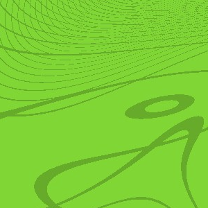
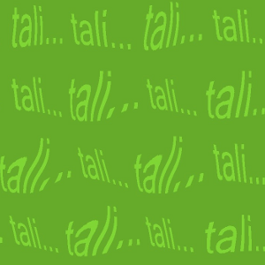
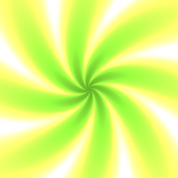
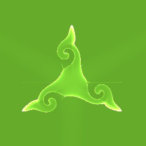
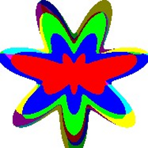
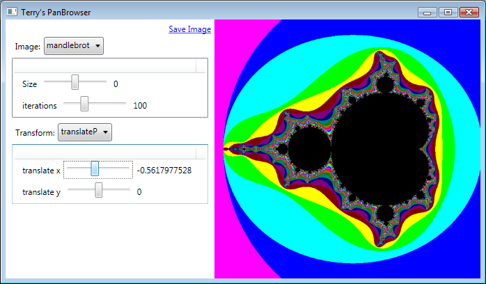

**Project Description**
While at Microsoft Research, Conal Elliott wrote a paper describing Functional Images: images and effects created from the application of functions, and christened them Pan.  PanBrowser implements a number of Pan functions in F#, and integrates them into a C# user interface.

## Gallery
(sorry, i'm a bit obsessed with the dark/light green theme...)
|| Stripes with Caustic || boxes with Caustic || tiletext with Caustic || ?? ||
|  |  |  |  |
|| bumpSwirl || another bumpSwirl || star swirl || herringbone with caustic ||
|  |  |  |  | 
|| rainbowRings with flower || || ||
|  | |  | | 

## GUI Features
Images and Transforms can only be written in the F# source code and compiled, but images and transforms can have parameters varied at runtime and can be composed:
* Selection of images and transforms (currently only one transform, but planned to be multiple)
* Sliders to set parameters to the functions
* Standard scale, rotate and translation sliders for pre- and post-transformed image
* Button to Save image
* Background rendering of successively higher resolution images up to four-times oversampled (antialiased)
* 3D Images and transforms - using a marching cubes algorithm to plot an outline or iso-surface
* Trackball to rotate 3D images
**Planned features**
* Gallery feature to display multiple images, transforms or combinations of settings
* Animation features to allow settings to be varied continuously - possible make this a screen-saver mode 
* Runtime editing and compilation of new images/transforms
* 

## Example Image Functions
For example, here's a Mandlebrot set in F#/Pan:

{{ 
//an image is a function that takes a Point (x,y) and returns a bool or Color
let mandlebrot p =
	let rec checkMand z i =
		if i > 200 then black
		else if (distFromOrigin z) > 2.0 then
			intToColor i
		else 
			checkMand (addp (complex2 z) p) (i+1)  // recurse with z=z^2 + p
	in checkMand origin 0
}}

And here's how you turn it inside-out:

{{
let polarTransform xf = toPolar >> xf >> fromPolar

//a Transform is a function that takes an image function and returns a new image function
//so F# type is (Point -> 'a) -> Point -> 'a  
let radialInvert = 
    let invert (r, th) = ( 1.0/r, th ) in
    transformImage (polarTransform invert)
}}

_See Also: [ExampleImages](ExampleImages); [Sliders](Sliders)_

## Inspired by
- [http://conal.net/pan/](http://conal.net/pan/)
- [http://www.haskell.org/edsl/pansharp.html](http://www.haskell.org/edsl/pansharp.html)
- Similarly inspired by Conal Elliot, Ken Peril, etc, and with an 'interesting' writing style: [http://users.info.unicaen.fr/~karczma/Work/Clastic_distr/clastic.html](http://users.info.unicaen.fr/~karczma/Work/Clastic_distr/clastic.html) - my challenge is to replicate his great example images in F#/PanBrowser
- [http://blogs.msdn.com/satnam_singh/archive/2010/01/06/an-f-functional-geometry-description-of-escher-s-fish.aspx](http://blogs.msdn.com/satnam_singh/archive/2010/01/06/an-f-functional-geometry-description-of-escher-s-fish.aspx) - Functional Geometry is only slightly different, and this shows an F# example

## Great Graphics sites
- [Greg Egan](http://gregegan.customer.netspace.net.au) - Great hard sci-fi plus graphics demos
- [Ken Perlin](http://mrl.nyu.edu/~perlin/) - professor, graphics guru, demo-writer extraordinaire, star!
- [Craig Ventrella](http://www.ventrella.com/) - graphics demos defying explanation
- [Matrix Ping Pong](http://albinoblacksheep.com/flash/pingpong.php) - so cool, i trust you've seen it already
- [http://www.openprocessing.org](http://www.openprocessing.org) - Visualisation scripting with great examples
